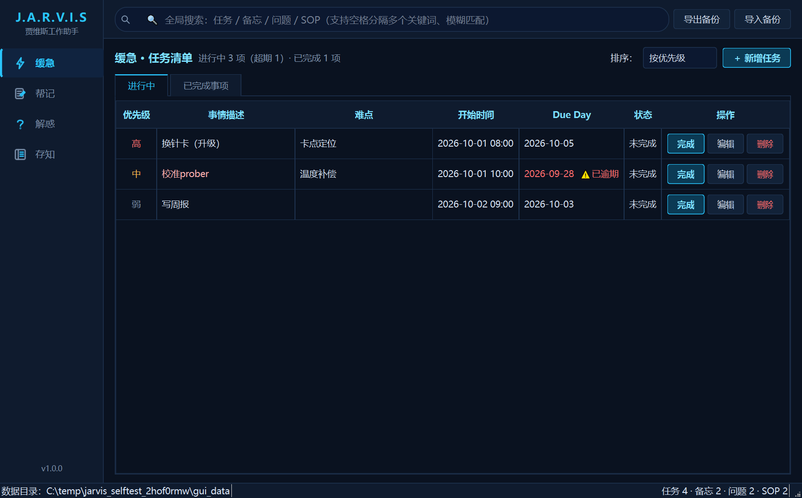
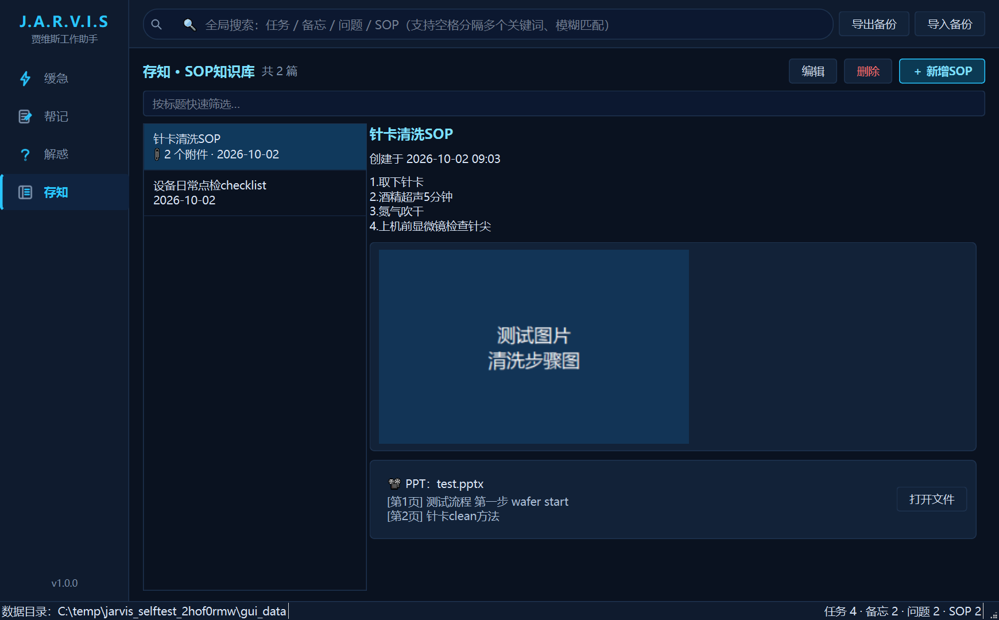
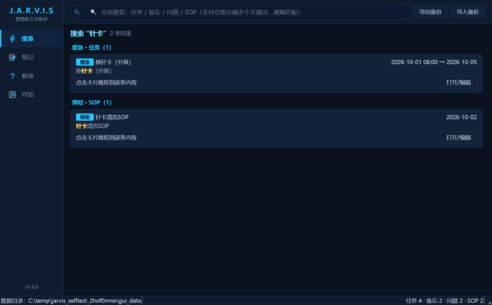
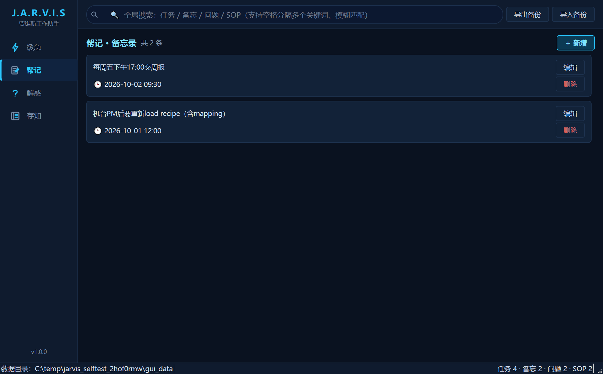
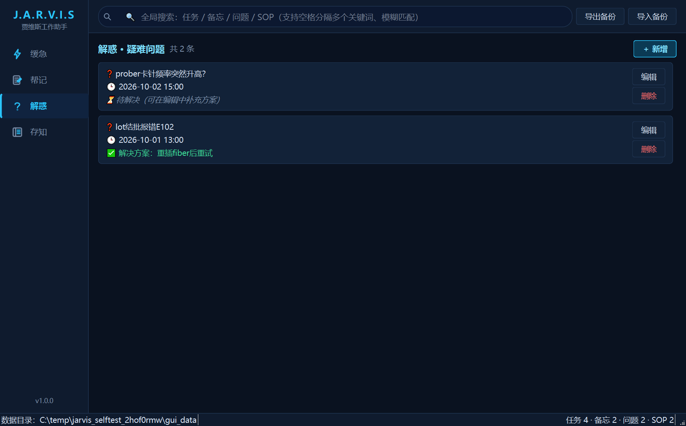
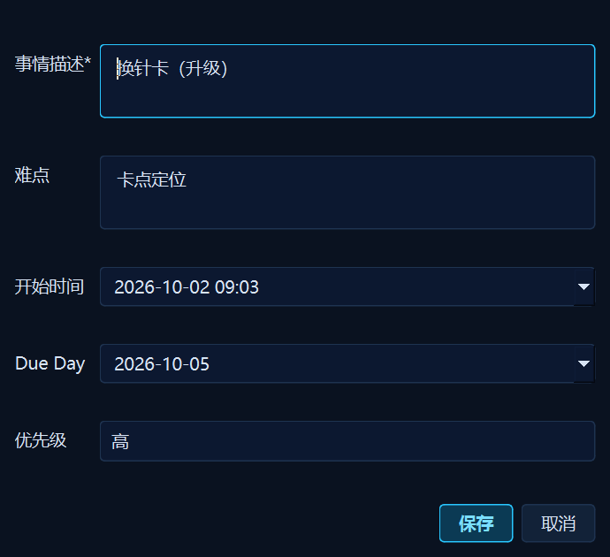

# 贾维斯 Jarvis

基于 **PySide6 (Qt6)** 的 Windows 单机工作助手：任务管理、备忘录、疑难问题、SOP 知识库、**异常处理（解异）**五大模块 + **周报时间轴** + **回收站防误删** + 跨模块全局搜索 + 一键备份，深色科幻风界面。PyInstaller 打包为免安装单文件 exe，**完全离线运行，数据 100% 本地保存**。

| 缓急 · 任务清单 | 存知 · SOP知识库 |
| --- | --- |
|  |  |
| **全局搜索（模糊 + 关联）** | **帮记 · 备忘录** |
|  |  |
| **解惑 · 疑难问题** | **编辑对话框** |
|  |  |

## 功能特性

- **缓急（任务清单）**：事情描述 / 难点 / 开始时间 / Due Day（精确到时分）/ 优先级（高·中·低·弱）；按优先级或 Due Day 排序；逾期任务红色"⚠已逾期"提醒；完成后自动归档到"已完成事项"页签，支持一键还原回清单。时间字段旁有「现在 / 今天」按钮一键填入当前日期时间。
- **帮记（备忘录）**：随手记录需要记住的内容与时间，卡片式展示，按时间倒序。
- **解惑（疑难问题）**：记录工作中不明白的问题，可先存问题、之后再补充解决方案；已解决的绿色标记、未解决的灰色"待解决"。
- **存知（SOP 知识库）**：标题 + 正文 + 附件。图片内嵌预览（点击看大图）；**.pptx 自动用标准库抽取每页文字**，无需安装 Office 即可预览和被搜索；也可调用系统默认程序打开原文件。左侧标题列表支持快速筛选。
- **解异（异常处理）**：按六要素记录（背景 What's the issue / 影响 What's the impact / 过往教训 Lesson learned / 行动 Action done / 原因 Root cause / 后续措施 How to prevent / follow up），支持粘贴截图；**一键生成单页汇报 PPT**（python-pptx，字号自适应保证内容再多也只占一页，图片右栏等比排列）；**时间线分析**（按时间从左到右）与**鱼骨图分析**（人/机/料/法/环），软件内预览、可导出 HTML（纯 SVG 实现，零图表库依赖）。
- **周报**：已完成事项按周（周一至周日）自动整理、进行中的一并归入，按时间从上到下生成时间轴；左侧周列表似歌单，点击查看该周工作总结，一键复制文字版。
- **全局搜索**：跨四大模块、覆盖所有字段（任务描述/难点、备忘内容、问题/方案、SOP 标题/正文/PPT 文字/附件名）。支持模糊匹配、空格分隔多关键词（跨字段关联命中也计入）、**拼音首字母与全拼**（如 `hzk` → 换针卡、`zhenka` → 换针卡），整句命中与标题命中加权排序，命中词黄色高亮，点击结果卡片直接跳转到对应条目。
- **到期提醒**：逾期 / 今日到期 / 3日内到期自动分组；状态栏红色角标（点击直达任务页）；托盘气泡通知，每半小时巡检一次、内容有变化才弹，不骚扰。
- **托盘常驻**：关闭窗口最小化到托盘（托盘菜单可关闭此行为），双击托盘图标恢复，提醒通知点击直达任务页。
- **一键备份**：导出 = 全部数据 + 附件打包成单个 zip；导入 = 从备份恢复（覆盖前二次确认）。换电脑迁移只需一个文件。
- **每日任务**：配置例行任务模板，工作日（周一至周五）自动生成当天任务实例；内置国务院官方节假日日历（`data/holidays.json`，可自行编辑追加新年度安排），自动跳过周末与节假日、识别调休补班。
- **回收站**：删除的记录统一进回收站保留 3 天，可一键恢复；超期自动彻底删除，SOP 附件文件在彻底删除时才真正清理。
- **全程自动刷新**：录入 / 编辑 / 删除 / 导入后，所有页面与搜索结果页即时同步，无需手动刷新；打开着的搜索结果也会自动重查，永不展示过期内容。
- **快捷键**：`Ctrl+F` 聚焦搜索、`Ctrl+N` 当前模块新增、`F5` 刷新、`Esc` 退出搜索。
- **界面记忆**：自动记住窗口大小/位置、上次停留页面、任务排序偏好（存于 `data\settings.json`）。
- **滚动自动备份**：每次启动和导入覆盖前，自动把数据文件快照到 `data\backups\` 并保留最近 5 份，误删/误导入可捞回。
- **便携化数据**：数据保存在 exe 旁边的 `data\` 文件夹（JSON + 附件），目录不可写时自动回退 `%APPDATA%`，状态栏实时显示实际位置。

## 快速开始

**直接使用（推荐）**：从 [Releases](../../releases) 下载 `贾维斯Jarvis.exe`，双击运行。无需安装 Python 和任何依赖，不联网。

**从源码运行**（Python 3.10+）：

```bash
pip install -r requirements.txt
python main.py
```

**运行自测**（79 项：数据层 CRUD / 状态流转 / 搜索与拼音匹配 / 时间格式与乱码自修复 / 节假日日历 / 每日任务生成 / 回收站与恢复 / 周报分组 / SVG图表 / 单页PPT / 导入导出与自动快照 / 自动刷新回归 / 托盘与到期提醒 / GUI 构建与截图）：

```bash
python selftest.py            # 界面截图输出到 assets/shots/
```

**打包 exe**：

```bash
build.bat                     # 或 python -m PyInstaller --onefile --windowed --icon assets/jarvis.ico --add-data "assets;assets" main.py
```

## 架构

界面 / 数据 / 搜索彻底分离，每加一个功能模块只需要"一个模块文件 + 注册表里一行"：

```
main.py                 入口（python main.py 运行；--selftest 自测）
app/
  common.py             通用工具：路径定位（exe 便携目录/APPDATA 回退）、时间、ID
  theme.py              深色科幻主题 QSS（配色常量集中于此）
  icons.py              程序内图标：QPainter 现场绘制，零图片依赖
  data_store.py         数据层：六大集合 CRUD、回收站软删除/恢复/过期清除、
                        每日任务实例化、原子写盘、附件管理、zip 导入导出
  holidays.py           节假日日历（内置2026官方安排，data/holidays.json 可编辑）
  search.py             搜索引擎：模糊 + 跨字段关联 + 拼音首字母/全拼，与模块零耦合
  svg_charts.py         时间线/鱼骨图 SVG 生成（预览与HTML导出共用）
  ppt_report.py         解异单页汇报PPT生成（python-pptx，字号自适应）
  dialogs.py            基础编辑对话框（任务/备忘/问题/SOP/看图）
  more_dialogs.py       每日任务/解异编辑、SVG图表预览对话框
  main_window.py        主窗口：侧边导航 + 顶部全局搜索 + NAV 模块注册表
  modules/
    tasks.py            缓急：任务表格（排序/逾期标记/归档还原）+ 每日任务页签
    card_base.py        卡片式模块基类（帮记/解惑共用）
    memos.py            帮记
    questions.py        解惑
    sop.py              存知：列表+详情分栏、图片缩略图、pptx 文字抽取
    anomalies.py        解异：六要素详情、PPT生成、时间线/鱼骨图
    weekly.py           周报：按周分组时间轴（歌单式周列表）
    trash_page.py       回收站：3天保留、恢复/彻底删除
    search_page.py      全局搜索结果页（分组/高亮/跳转）
tools/make_icon.py      重新生成应用图标（依赖 Pillow）
```

**数据结构**：单一 JSON（`data/jarvis_data.json`）保存四大集合，附件实体文件存 `data/attachments/`；写入采用临时文件 + `os.replace` 原子替换，避免意外断电损坏数据；另有 `backups/`（启动与导入前的滚动快照）和 `settings.json`（界面状态记忆）。

**新增一个模块只要三步**：在 `app/modules/` 写一个模块类（提供 `refresh()` / `search_records()` / `locate()`）→ 在 `main_window.py` 的 `NAV` 列表加一行 → 完成（搜索、状态栏计数自动接入）。删减模块反过来做即可。

## 设计取舍

- **不联网、无外部服务**：搜索用自研的轻量打分引擎而非全文检索库，pptx 解析用标准库 zipfile+xml 而非 python-pptx，依赖只有 PySide6 和纯 Python 的 pypinyin（拼音搜索；缺失时该功能自动降级关闭，其余不受影响），弱配老电脑也能秒开。
- **JSON 而非 SQLite**：个人单机数据量下，JSON 可读、可 diff、备份即拷贝，出问题肉眼可查；导入/导出直接是"一个 zip"。
- **QPainter 图标**：应用图标与导航图标全部程序绘制，仓库里没有二进制图片负担，改配色一处生效。

## License

[MIT](LICENSE)
